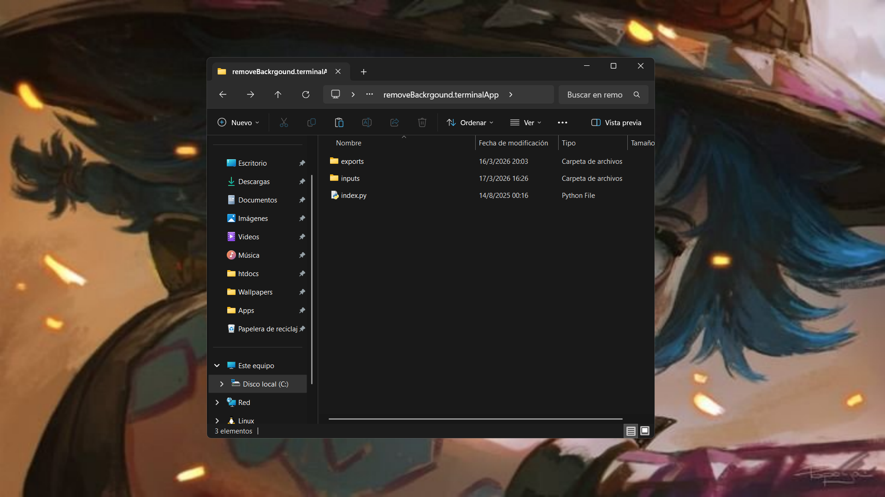
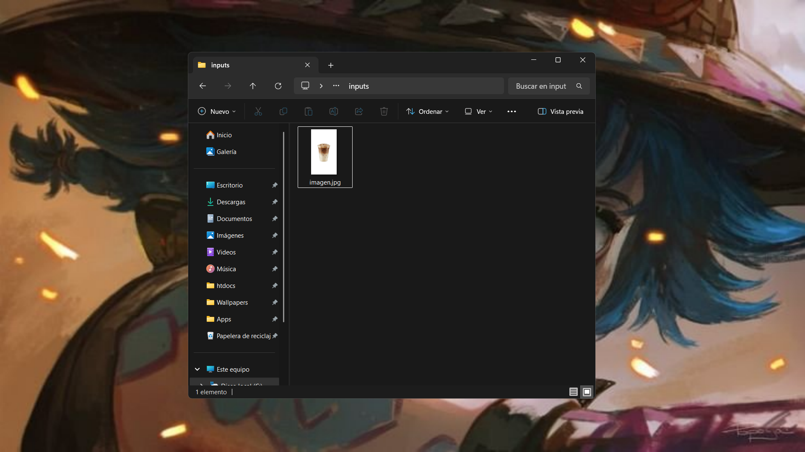
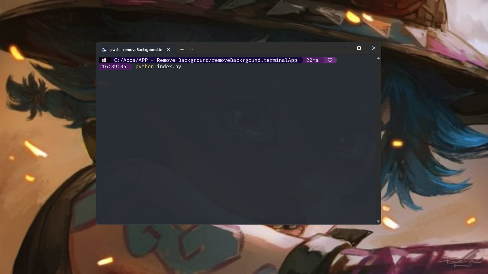
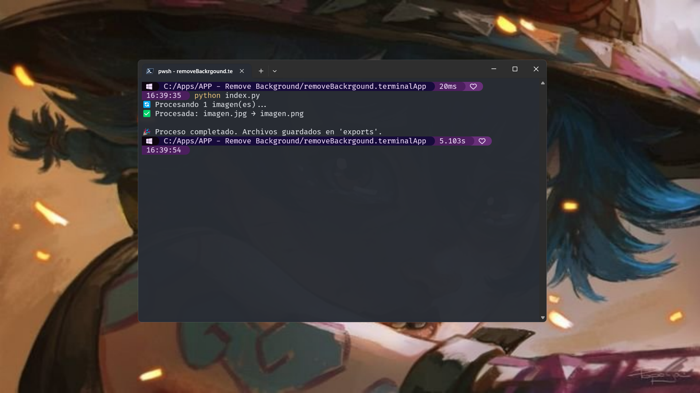
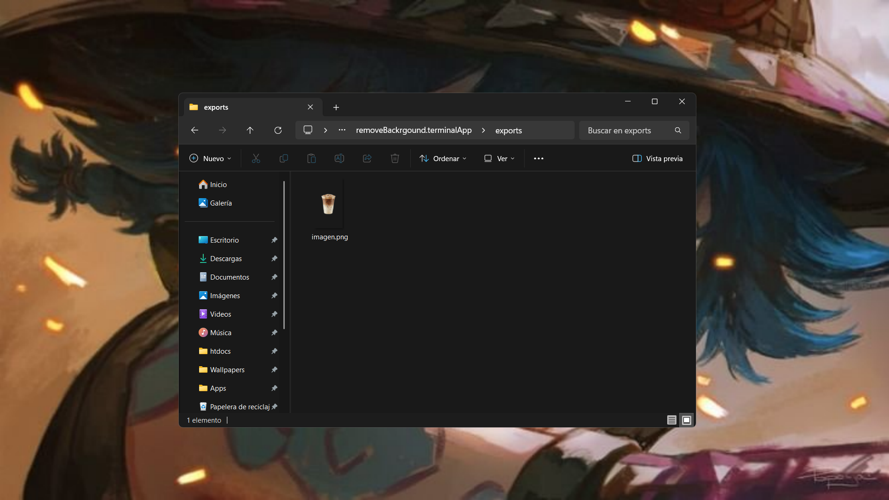

# remove-backgroud-terminal

Este es un srcipt en Python para retirar el fondo de imagenes y exportarlas en formato .png con trasparencia.

## Uso
Es importante verificar que junto al archivo index.php, se encuentren creadas las carpetas `./inputs` y `./exports` con la finalidad de garantizar  el correcto funcionamiento.

Seguidamente ponemos la imagen que deseamos modificar, dentro de la carpeta `./inputs`.

Luego ejecutamos el archivo `index.py`, ya sea dando doble click al archivo o ejecutando desde la terminal.

> Este script no requiere permisos de administrador

Una vez procesada la imagen, veremos por pantalla algo como lo siguiente:

Acto seguido podemos dirigirnos a la carpeta `./exports` en donde podremos encontrar la imagen en formato .png y con fondo transparente.

## Notas
- El script no admite multiples idiomas, por favor cree las carpetas con los nombres exactos `inputs` y `exports`.
- El script no requiere permisos de administrador para ser usado.
- El script no es perfecto y algunas imagenes podrían llegar a tener imperfecciones.
